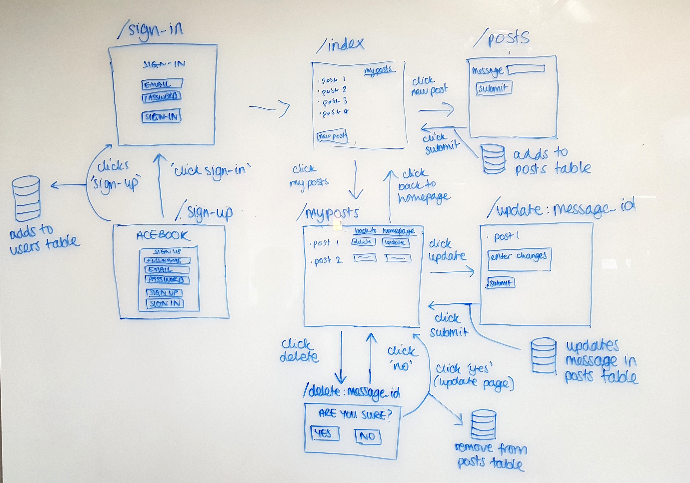

# AceBook


__Team Collaborators__

- Alasdair Wem - https://github.com/wemsteral
- Tara Sankhalpara - https://github.com/tsankhalpara
- Frankie Bamgboye - https://github.com/FrankieBoye
- Michael Darmody - https://github.com/Michael-Darmody
- Sejin Kim - https://github.com/sejinkay
- Simon Chenbo Yi - https://github.com/SimonChenboYi

### User stories - Features
```
As User
So I can share my life with my friends
I want to be able sign up for an account with Acebook

As a User
So I am identifiable to Acebook
I want to use my personal email to sign up

As a User
So my friends know who I am
I want to give my name at sign up

As a User
So I don’t get confused with other people
I want to give my last name at sign up

As a User
So only I can access my account
I want to provide a personal password

As a User
So that I can access the content  in Acebook
I want to able to be authenticated by logging in to my account;

As a User
So that I can log into my Acebook  account
I want to be able to input my username and password on the homepage.

As a User
So i can confirm my login
I would like to receive an error message if I get my username or password incorrect

As a User
So that I can log into my Acebook  account
I want to be able to go to my personal page after login.

As a User
I would like to have my own page
So that I can see all my own posts

As a User
I would like a form
so that I can add posts

As a User
I can click a delete button
so that i can delete my own posts

As a User
I can click an update button
so that i can update my own existing posts

Additional user stories:
As a User
I would like to see a pop up message
so that i know my post has been removed

As a User
I would like to see a pop up message
so that i know my post has been updated
```


REQUIRED INSTRUCTIONS:

1. Fork this repository to `acebook-teamname` and customize
the below**

[You can find the engineering project outline here.](https://github.com/makersacademy/course/tree/master/engineering_projects/rails)

2. The card wall is here: [Trello](https://trello.com/b/mEsYmCtH/acebook-mvp)

## How to contribute to this project
See [CONTRIBUTING.md](CONTRIBUTING.md)

## Quickstart

First, clone this repository. Then:

```bash
> bundle install
> bin/rails db:create
> bin/rails db:migrate

> bundle exec rspec # Run the tests to ensure it works
> bin/rails server # Start the server at localhost:3000
```
